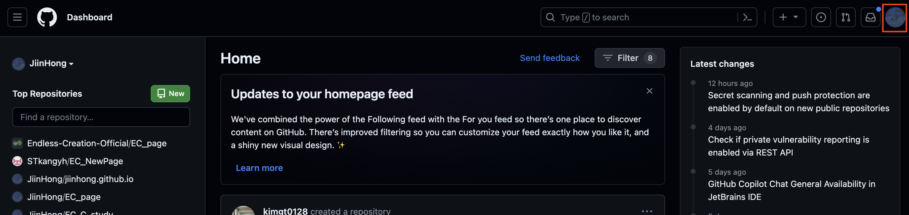
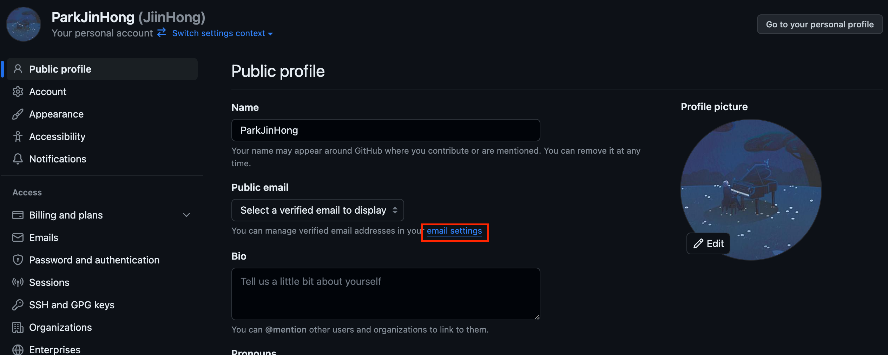
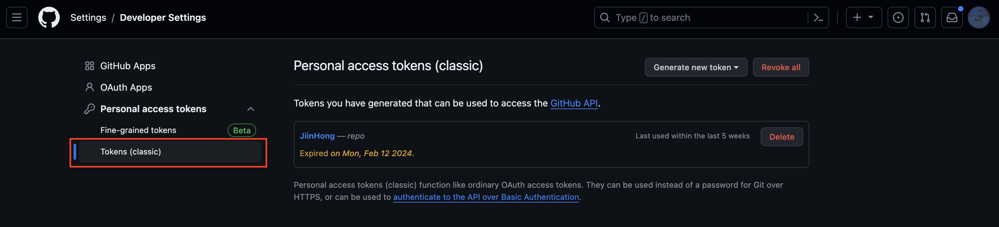
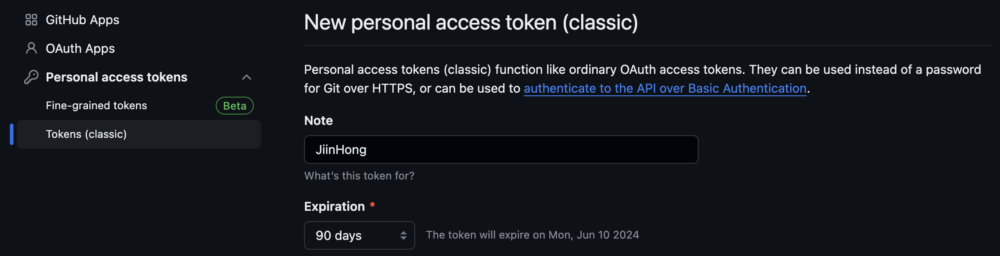
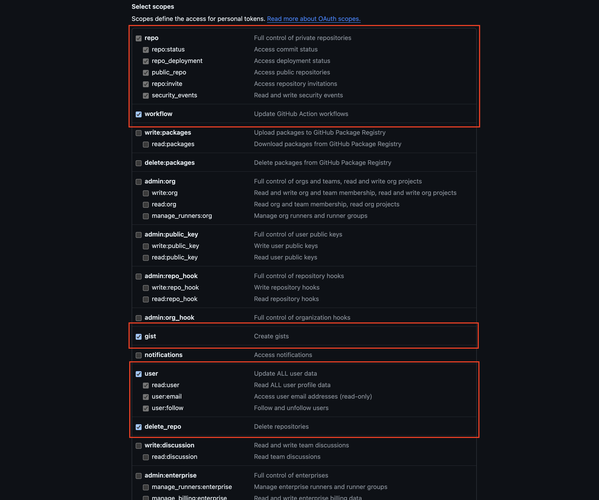
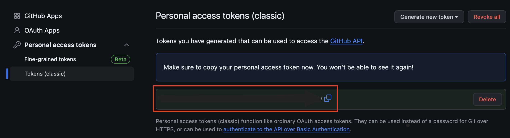

# 0주차

내용: 스터디 환경 세팅, Hello World

## 1. 스터디 환경 세팅

### 가입해야할 사이트

- Github : [https://github.com/](https://github.com/)
    
    (1) 깃허브 회원가입

    <br/>

    (2) 이메일 설정 변경
    
     먼저 오른쪽 위의 프로필 사진을 클릭하여 Settings를 클릭합니다.
    
    
    
    <br/>
    
    Settings에 Public email에 email settings를 들어갑니다!
    
    
    
    그리고 Keep my email addresses private의 체크 표시를 해제해줍니다!
    
    <br/>

    (3) 토큰 생성하기
    
    Settings에 들어가서 메뉴의 맨 밑에 있는 Developer Settings를 들어갑니다.
    
    Personal access tokens를 클릭하고, Tokens (classic)에 들어갑니다.
    
    

    <br/>
    
    Generate new token 버튼을 클릭하고, Generate new token (classic)에 들어갑니다.
    
    note에는 자신의 이름(아무거나 써도 됩니다)을 입력하고, Expiration을 90일로 설정합니다. 이는 이 토큰의 유효기간은 90일이라는 의미이고, no expiration으로 설정하면 무기한이 되지만, 보통 90일에 한 번씩은 재설정해주는 것이 안전합니다.
    
    

    <br/>
    
    빨간 표시가 되어있는 칸을 체크해주고 Generate token 버튼을 누릅니다.
    
    
    
    <br/>

    빨간 표시가 되어있는 부분은 반드시 복사하셔서 메모장에 저장해놓으셔야 합니다!
    
    
    

- 백준 온라인 저지 사이트 : [https://www.acmicpc.net/](https://www.acmicpc.net/)
    
    (1) 회원가입
    
    (2) 서울과학기술대학교 이메일을 이용하여 학교 등록
    
    (3) Endless Creation 그룹에 가입

    <br/>
    
- 솔브드 : [https://solved.ac/](https://solved.ac/)
    
    백준과 연동만 시키면 됨

    <br/>

- VScode 설치
    - 언어 팩 설치 (한국어로 변경)
    - 터미널 글꼴 크기 설정
    - Hello World 출력해보기!

<br/>

## 2. Hello World

무작정 따라해보세요! 하나도 이해가 가지 않아도 됩니다. 어차피 뒤에서 다 배우게 됩니다!!

```
#include <stdio.h>

int main(void)
{
	printf("Hello World");
	return 0;
}
```

#include <stdio.h> : 기본입출력 함수를 제공해주는 라이브러리 호출

int main() : main이라는 함수 호출, 그리고 그 함수의 반환값을 int형으로 지정

printf() : 사용자에게 '출력'기능을 제공해주는 기본적인 함수

return : 하나의 함수가 종료될 때, 반환값을 지정해주는 문법

<br/>

C언어에서 main 함수는 파일이 실행되면 가장 먼저 실행되는 함수로 약속되어있습니다.
