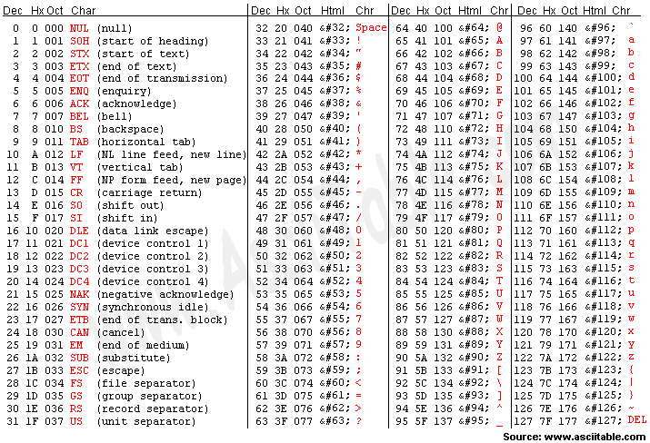

# 1주차

### 1. 변수

---

**Variables** : 변수

**변수 선언해보기! (자료형 선언)**

```c
#include <stdio.h>

int main(void)
{
	int x; // 정수 선언
	x = 3;
	printf("x : %d \n",x);
	printf("x의 메모리 용량은 %d \n",sizeof(x));

	float y; // 실수 선언
	y = 123456789.123456789; 
	printf("y : %f \n",y); // 정상적으로 출력되지않음 (출력값 : 123456792.000000)
	printf("y의 메모리 용량은 %d \n",sizeof(y));

/*
float 자료형은 4바이트까지밖에 담을 수 없기 때문에
double 자료형을 이용해야한다
*/

	double z; // 실수 선언
	z = 123456789.123456789;
	printf("z : %f \n",x);
	printf("z의 메모리 용량은 %d \n",sizeof(z));

	return 0;
}
```

다음은 자료형의 메모리 크기입니다. 지금 외우실 필요 전혀없고, ‘그냥 그렇구나~’ 해주세요!

<br/>

정수형

char : 1 byte

short : 2 byte

int : 4 byte

long : 4 byte

long long : 8 byte  

<br/>

실수형

float : 4 byte

double : 8 byte

long double : 8 byte

<br/>

그렇다면 int형의 최댓값과 최솟값은?

```c
#include <stdio.h>
#include <limits.h>

int main(void)
{
	int x = LONG_MAX;
	printf("int형의 최댓값 x는 %d \n", x); // 출력값 : 2147483647 (약 21억)
	
	// 여기서 1을 더하면 어떻게 될까?
	printf("int형의 최댓값 x에 1을 더하면? %d \n", x+1); // 출력값 : -2147483648

	/*
	int형이 가질 수 있는 최댓값을 넘어가면,
	오히려 최솟값으로 돌아가게 됩니다.
	이 현상을 오버플로우(overflow)라고 합니다.
	*/

	return 0;
}
```

<br/>

<간단한 사칙연산>

```c
#include <stdio.h>

int main(void)
{
	int x = 3;
	int y = 5;
	printf("x = %d \n", x);
	printf("y = %d \n", y);
	printf("x + y = %d \n", x + y);
	printf("x - y = %d \n", x - y);
	printf("x * y = %d \n", x * y);
	printf("x / y = %d \n", x / y); // 몫만 출력
	printf("x / y = %d \n", x % y); // 나머지만 출력

	// 실제 나눈 값을 알고 싶다면, 연산을 실수형으로 수행해야합니다.
	printf("x / y = %f \n", (double)x / y); // 실제 나눈 값
	return 0;
}
```

<br/>

### 2. 자료형

문자를 표현할 때 

→ char

숫자를 표현할 때

→ int, float, double

자료형 자체가 없을 때

→ void

<br/>

연봉 계산해보기

```c
#include <stdio.h>
#define MONTHS 12 // define은 상수를 정의할 때 사용합니다.

int main(void)
{
	double monthSalary = 500.5;
	printf("%.2f만원 \n", monthSalary * MONTHS);

	return 0;
}

// 출력 : 6006.00만원
```

<br/>

문자 출력해보기!

```c
#include <stdio.h>

int main(void)
{
	char x = 'A';
	printf("%c \n", x); // 문자를 출력할 때는 %c를 사용합니다.
}
```

<br/>

### <아스키코드>

[https://www.ascii-codes.com/](https://www.ascii-codes.com/)



문자열은 사실 컴퓨터 내부에서 숫자로 동작되기 때문에, 아스키코드로 약속된 값(숫자)을 이용합니다. 

예를 들어, A라는 문자는 65라는 수로 약속되어있어서, 65를 %c로 출력하면 A가 출력되고, A를 %d로 출력하면 65가 출력됩니다.

```c
#include <stdio.h>

int main(void)
{
	char x = 'A';
	printf("%d \n", x); // A를 %d로 출력하면, 65가 출력됨
	
	int y = 65;
	printf("%c \n", y); // 65를 %c로 출력하면, A가 출력됨
	
	return 0;
}

/* 
출력
65 
A
*/
```

<br/>

### <진수법>

10진수 : 0 1 2 3 4 5 6 7 8 9 10 11 12 13 14 15 16 17 18 19 20 …

8진수 : 0 1 2 3 4 5 6 7 10 11 12 13 14 15 16 17 20 21 22 23 …

16진수 : 0 1 2 3 4 5 6 7 8 9 A B C D E F 10 11 12 13 …

<br/>

100이라는 수를 각각 10진수, 8진수, 16진수로 출력해보기

```c
#include <stdio.h>

int main(void)
{
	int x = 100;
	printf("10진수로 출력 : %d \n", x); // %d : 10진수로 출력
	printf("8진수로 출력 : %o \n", x); // %o : 8진수로 출력
	printf("16진수로 출력 : %x \n", x); // %x : 16진수로 출력
}

/*
출력
10진수로 출력 : 100 
8진수로 출력 : 144 
16진수로 출력 : 64
*/
```

<br/>

### 3. 연산자

---

초(second)단위를 분(minute)단위로 바꾸는 예제

```c
#include <stdio.h>
#define SECOND_PER_MINUTE 60

int main(void)
{
	int input = 1000;
	int minute = input / SECOND_PER_MINUTE;
	int second = input % SECOND_PER_MINUTE;
	printf("%d초는 %d분 %d초입니다.\n", input, minute, second);
}

// 출력 : 1000초는 16분 40초입니다.
```

<br/>

### <증감연산자>

x++ → x에 +1을 한다

++x → x에 +1을 한다

x— → x에 -1을 한다

—x → x에 -1을 한다

<br/>

그러면 x—, —x의 차이점은?

```c
#include <stdio.h>

int main(void)
{
	int x = 0;
	printf("현재의 x는 %d입니다\n", x);
	x++;
	printf("현재의 x는 %d입니다\n", x);
	printf("현재의 x는 %d입니다\n", x--); // 화면에 출력한 뒤, -1을 함
	printf("현재의 x는 %d입니다\n", x);
	printf("현재의 x는 %d입니다\n", --x); // -1을 하고, 화면에 출력함
	return 0;
}

/*
출력
현재의 x는 0입니다
현재의 x는 1입니다
현재의 x는 1입니다
현재의 x는 0입니다
현재의 x는 -1입니다
*/
```

<br/>

### <복합대입연산자>

x += 1 은 x = x + 1과 같습니다.

-=,*=,/=,%= 에도 동일하게 적용됩니다.

증감연산자와 복합대입연산자는 코드의 길이를 줄일 수 있어서 자주 쓰이니, 알아두면 좋습니다!

```c
#include <stdio.h>

int main(void)
{
	int x = 100;
	printf("현재 x의 값은 %d입니다.\n", x);
	x += 50; // x = x + 50;
	printf("현재 x의 값은 %d입니다.\n", x);
	x -= 50; // x = x - 50;
	printf("현재 x의 값은 %d입니다.\n", x);
	x *= 50; // x = x * 50;
	printf("현재 x의 값은 %d입니다.\n", x);
	x /= 50; // x = x / 50;
	printf("현재 x의 값은 %d입니다.\n", x);
	x %= 3; // x = x % 3;
	printf("현재 x의 값은 %d입니다.\n", x);

	return 0;
}

/*
출력
현재 x의 값은 100입니다.
현재 x의 값은 150입니다.
현재 x의 값은 100입니다.
현재 x의 값은 5000입니다.
현재 x의 값은 100입니다.
현재 x의 값은 1입니다.
*/
```

<br/>

### <관계연산자>

== : x와 y가 같은지 판별

!= : x와 y가 다른지 판별

<,> : x와 y의 대소 판별

```c
#include <stdio.h>

int main(void)
{
	int x = 50, y = 30;
	printf("x와 y가 같은가? \n%d\n", x == y);
	printf("x와 y가 다른가? \n%d\n", x != y);
	printf("x와 y가 큰가? \n%d\n", x > y);
	printf("x와 y가 작은가? \n%d\n", x < y);
	printf("x에 30읗 넣으면? \n%d\n", x = y);

	return 0;
}

/*
출력
x와 y가 같은가? 
0
x와 y가 다른가? 
1
x와 y가 큰가? 
1
x와 y가 작은가? 
0
x에 30읗 넣으면? 
30
*/
```

<br/>

&& : and 

→ 둘 다 True여야만 True 반환

|| : or 

→ 둘 중 하나만 True여도 True 반환

```c
#include <stdio.h>

int main(void)
{
	int x = 50, y = 30;
	printf("x가 y보다 크고, y는 40보다 작습니까?\n%d\n", (x>y) && (y < 40));
	printf("x가 y보다 작거나 혹은 y는 30입니까?\n%d\n", (x>y) || (y < 40));

	return 0;
}

/*
출력
x가 y보다 크고, y는 40보다 작습니까?
1
x가 y보다 작거나 혹은 y는 30입니까?
1
*/
```

<br/>

### <조건연산자>

A ? B : C

→ A가 참이면 B를 반환하고, A가 거짓이면 C를 반환

```c
#include <stdio.h>

int main(void)
{
	int x = -50, y = 30;
	int absX = (x > 0) ? x : -x; // x가 0보다 크면 x를 반환하고, x가 0보다 작으면 -x를 반환
	printf("x의 절댓값은 %d\n", absX);

	int max = (x > y) ? x : y;
	int min = (x < y) ? x : y;
	printf("x와 y 중 큰 값은 %d\n", max);
	printf("x와 y 중 작은 값은 %d\n", min);

	return 0;
}

/*
출력
x의 절댓값은 50
x와 y 중 큰 값은 30
x와 y 중 작은 값은 -50
*/
```

<br/>

### <pow()>

pow()는 거듭제곱을 연산해주는 함수입니다.

pow(a,b) → a의 b제곱 (ex. pow(2,3) → 2의 세제곱)

```c
#include <stdio.h>
#include <math.h> // pow(),abs() 등의 함수들이 들어있는 math 라이브러리 호출

int main(void)
{
	int x = pow(2,20);
	printf("2의 20제곱은 %d입니다\n", x);

	return 0;
}

/*
출력
2의 20제곱은 1048576입니다
*/
```
